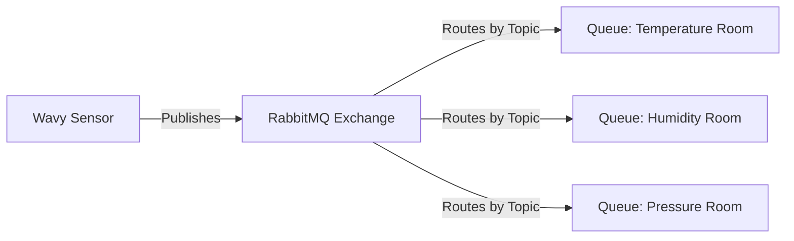
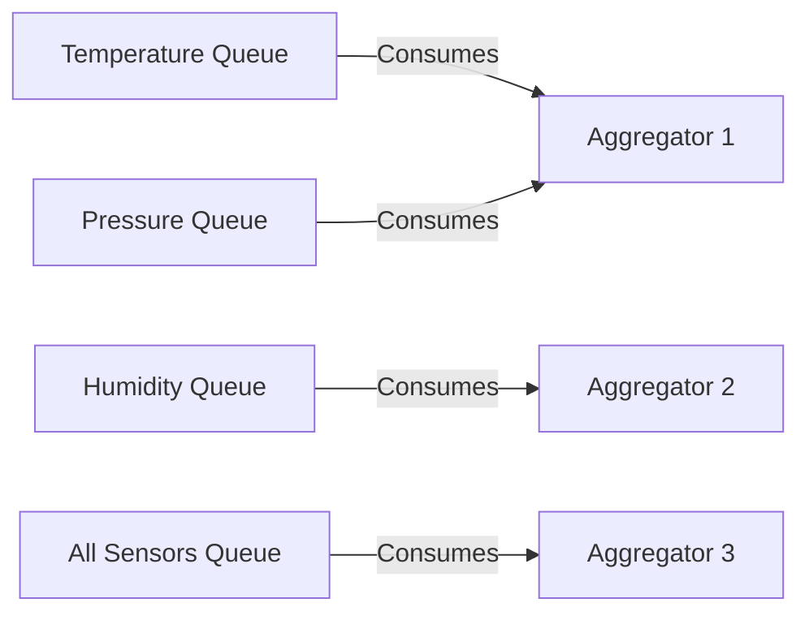

# Ocean Monitoring System - Publish/Subscribe Architecture

## Table of Contents
1. [Overview](#overview)
2. [Architecture Components](#architecture-components)
3. [Topic-Based Routing](#topic-based-routing)
4. [Message Flow](#message-flow)
5. [Implementation Details](#implementation-details)
6. [Configuration](#configuration)
7. [Usage Examples](#usage-examples)
8. [Best Practices](#best-practices)
9. [Troubleshooting](#troubleshooting)

## Overview

The Ocean Monitoring System has been redesigned to use a **publish/subscribe (pub/sub) architecture** with **topic-based routing** through RabbitMQ. This replaces the previous direct TCP connection model with a more scalable, flexible, and resilient messaging system.

### Key Benefits
- **Decoupling**: Wavy sensors and Aggregators are completely decoupled
- **Scalability**: Easy to add new sensors and aggregators without configuration changes
- **Flexibility**: Aggregators can subscribe to specific data types (topics)
- **Reliability**: Built-in message persistence and automatic recovery
- **Room-Based Organization**: Data is organized into logical "rooms" by sensor type

## Architecture Components

### 1. RabbitMQ Message Broker
- **Service**: Centralized message broker handling all communication
- **Management UI**: Available at `http://localhost:15672`
- **Credentials**: `oceanguest` / `oceanpass`
- **Exchange**: `ocean_monitoring_exchange` (topic exchange)

### 2. Wavy Sensors (Publishers)
- **Role**: Publish sensor data to specific topics
- **Topics**: Publish to topic patterns like `sensor.{type}.{wavy_id}`
- **Message Types**: DATA_SEND, MAINTENANCE_STATE_UP, MAINTENANCE_STATE_DOWN, DISC_REQ

### 3. Aggregators (Subscribers)
- **Role**: Subscribe to specific topics and process incoming data
- **Selective Subscription**: Can choose which sensor types to monitor
- **Room-Based Processing**: Process data from specific "rooms" (sensor types)

## Topic-Based Routing

### Topic Structure
The system uses a hierarchical topic structure for organizing messages:

```
sensor.{sensor_type}.{wavy_id}.{message_type}
```

#### Examples:
- `sensor.temperature.wavy001.data` - Temperature data from Wavy001
- `sensor.humidity.wavy002.data` - Humidity data from Wavy002
- `sensor.pressure.wavy001.maintenance` - Maintenance message from Wavy001
- `sensor.*.wavy001.*` - All messages from Wavy001
- `sensor.temperature.*.*` - All temperature sensor data

### Room Concept
"Rooms" are logical groupings of sensors by type:
- **Temperature Room**: `sensor.temperature.*.*`
- **Humidity Room**: `sensor.humidity.*.*`
- **Pressure Room**: `sensor.pressure.*.*`
- **Mixed Room**: `sensor.*.*.*` (all sensor data)

### Routing Patterns
Aggregators can subscribe using RabbitMQ routing patterns:
- `#` - Matches all topics
- `*` - Matches exactly one word
- `sensor.temperature.#` - All temperature sensor messages
- `sensor.*.wavy001.data` - All data messages from Wavy001

## Message Flow

### 1. Sensor Data Publishing


### 2. Aggregator Subscription


### 3. Complete Data Flow
1. **Wavy Sensor** generates sensor data
2. **Wavy** creates `RabbitMQMessage` with appropriate topic
3. **RabbitMQ Exchange** receives message and routes by topic
4. **Queue(s)** store messages for subscribers
5. **Aggregator(s)** consume messages from subscribed queues
6. **Aggregator** processes data and stores/forwards as needed

## Implementation Details

### Message Structure
```csharp
public class RabbitMQMessage
{
    public string MessageId { get; set; }         // Unique message identifier
    public string WavyId { get; set; }            // Source sensor ID
    public string MessageType { get; set; }       // DATA_SEND, MAINTENANCE, etc.
    public DateTime Timestamp { get; set; }       // Message creation time
    public DataWavy[] SensorData { get; set; }    // Actual sensor readings
    public string DataFormat { get; set; }        // JSON or CSV
    public string Payload { get; set; }           // Additional data
    public byte Priority { get; set; }            // Message priority (0-255)
    public string TargetQueue { get; set; }       // Optional target queue
}
```

### Topic Generation
Wavy sensors generate topics based on their sensor types:
```csharp
private string GenerateTopic(string sensorType, string wavyId, string messageType)
{
    return $"sensor.{sensorType.ToLower()}.{wavyId}.{messageType.ToLower()}";
}
```

### Queue Declaration
Each "room" has a dedicated queue:
```csharp
// Temperature room queue
channel.QueueDeclare(
    queue: "temperature_room_queue",
    durable: true,
    exclusive: false,
    autoDelete: false,
    arguments: null
);

// Bind to temperature topics
channel.QueueBind(
    queue: "temperature_room_queue",
    exchange: "ocean_monitoring_exchange",
    routingKey: "sensor.temperature.*.*"
);
```

## Configuration

### Docker Compose Configuration
```yaml
rabbitmq:
  image: rabbitmq:3-management-alpine
  container_name: rabbitmq
  ports:
    - "5672:5672"      # AMQP port
    - "15672:15672"    # Management UI
  environment:
    RABBITMQ_DEFAULT_USER: oceanguest
    RABBITMQ_DEFAULT_PASS: oceanpass
```

### Wavy Configuration
```yaml
wavy1:
  environment:
    - RABBITMQ_HOST=rabbitmq
    - RABBITMQ_PORT=5672
    - RABBITMQ_USERNAME=oceanguest
    - RABBITMQ_PASSWORD=oceanpass
    - SENSOR_TYPE=temperature    # Determines topic prefix
```

### Aggregator Configuration
```yaml
aggregator1:
  environment:
    - RABBITMQ_HOST=rabbitmq
    - RABBITMQ_PORT=5672
    - RABBITMQ_USERNAME=oceanguest
    - RABBITMQ_PASSWORD=oceanpass
    - SUBSCRIBE_TOPICS=sensor.temperature.*.*,sensor.pressure.*.*
```

## Usage Examples

### 1. Temperature Room Aggregator
An aggregator that only processes temperature data:

```csharp
// Subscribe to temperature room
var topics = new[] { "sensor.temperature.*.*" };
rabbitMQService.StartConsuming("temperature_room_queue", topics, ProcessTemperatureData);

private void ProcessTemperatureData(RabbitMQMessage message)
{
    Console.WriteLine($"Temperature data from {message.WavyId}: {message.SensorData}");
    // Process temperature-specific logic
}
```

### 2. Multi-Room Aggregator
An aggregator that processes multiple sensor types:

```csharp
// Subscribe to multiple rooms
var topics = new[] { 
    "sensor.temperature.*.*", 
    "sensor.humidity.*.*",
    "sensor.pressure.*.*"
};
rabbitMQService.StartConsuming("multi_room_queue", topics, ProcessMixedData);
```

### 3. Specific Wavy Monitor
An aggregator monitoring a specific Wavy device:

```csharp
// Monitor all data from Wavy001
var topics = new[] { "sensor.*.wavy001.*" };
rabbitMQService.StartConsuming("wavy001_monitor_queue", topics, ProcessWavy001Data);
```

### 4. Maintenance Monitor
An aggregator that only handles maintenance messages:

```csharp
// Monitor maintenance messages from all sensors
var topics = new[] { "sensor.*.*.maintenance" };
rabbitMQService.StartConsuming("maintenance_queue", topics, ProcessMaintenanceData);
```

## Best Practices

### 1. Topic Design
- Use consistent naming conventions
- Keep topics hierarchical and meaningful
- Avoid overly complex topic structures
- Plan for future expansion

### 2. Queue Management
- Use durable queues for important data
- Implement proper error handling
- Set appropriate TTL for messages
- Monitor queue lengths

### 3. Message Design
- Keep messages lightweight but complete
- Use appropriate serialization (JSON recommended)
- Include sufficient metadata for routing
- Implement message versioning for future compatibility

### 4. Consumer Design
- Implement idempotent message processing
- Use acknowledgments properly
- Handle reconnection gracefully
- Process messages efficiently to avoid queue buildup

### 5. Monitoring
- Monitor queue depths regularly
- Track message processing rates
- Set up alerts for connection failures
- Use RabbitMQ management tools

## Troubleshooting

### Common Issues

#### 1. Connection Problems
```bash
# Check RabbitMQ status
docker exec rabbitmq rabbitmq-diagnostics status

# Check logs
docker logs rabbitmq
```

#### 2. Message Not Being Delivered
- Verify topic/routing key patterns
- Check queue bindings
- Ensure exchange exists and is correct type
- Verify message format

#### 3. High Memory Usage
- Check for unprocessed messages in queues
- Implement message TTL
- Optimize message processing speed
- Consider message acknowledgment patterns

#### 4. Performance Issues
- Monitor queue lengths
- Check consumer processing rates
- Optimize message serialization
- Consider parallel processing

### Debugging Commands

```bash
# List all queues
docker exec rabbitmq rabbitmqctl list_queues name messages

# List exchanges
docker exec rabbitmq rabbitmqctl list_exchanges

# List bindings
docker exec rabbitmq rabbitmqctl list_bindings

# Purge a queue
docker exec rabbitmq rabbitmqctl purge_queue queue_name
```

### Monitoring Endpoints

- **Management UI**: `http://localhost:15672`
- **API Endpoint**: `http://localhost:15672/api/`
- **Health Check**: `http://localhost:15672/api/healthchecks/node`

## Migration from TCP

### Key Changes from Previous Architecture

1. **Connection Model**: 
   - **Before**: Direct TCP connections between Wavy and Aggregator
   - **After**: Indirect communication through RabbitMQ

2. **Data Flow**:
   - **Before**: Point-to-point communication
   - **After**: Publish/subscribe with topic-based routing

3. **Scalability**:
   - **Before**: Limited by direct connections
   - **After**: Unlimited scalability through message broker

4. **Configuration**:
   - **Before**: Aggregator IP/Port in Wavy configuration
   - **After**: RabbitMQ connection details and topic subscriptions

### Migration Checklist

- [ ] Update Docker Compose with RabbitMQ service
- [ ] Add RabbitMQ.Client NuGet packages to all projects
- [ ] Implement RabbitMQService in Common library
- [ ] Update Wavy to publish messages instead of TCP send
- [ ] Update Aggregator to consume messages instead of TCP listen
- [ ] Configure topic-based routing for each aggregator
- [ ] Test end-to-end message flow
- [ ] Update monitoring and logging
- [ ] Update documentation and operational procedures

This pub/sub architecture provides a robust, scalable foundation for the Ocean Monitoring System, enabling flexible data routing and easy system expansion.
